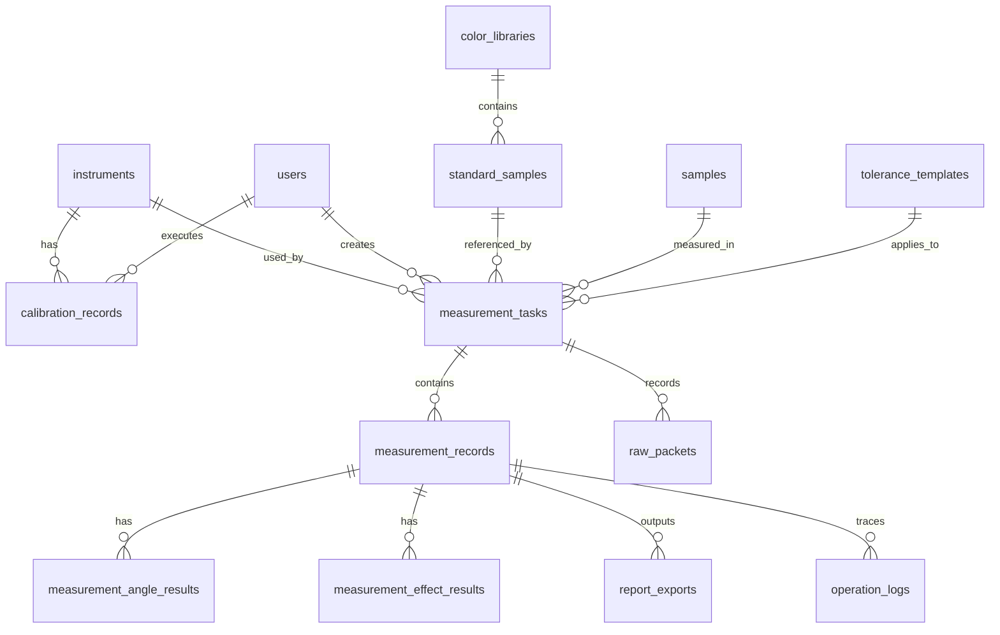

# 多角度测色仪上位机系统 V1.0
## 数据库表设计 + 字段定义 + 关系图

文档编号：MAS-DB-V1.0-01  
版本：V1.0  
日期：2026-03-26  
状态：评审版  
适用范围：Windows 上位机本地 SQLite 数据库

---

## 1. 设计目标

本数据库设计用于支撑多角度测色仪上位机软件的以下核心业务：

1. 仪器连接、校准、测量、判定、报告的全流程留痕。
2. 标准样、试样、颜色库、容差模板的统一管理。
3. 多角度颜色数据、效果数据和综合结论的结构化存储。
4. 支持本地离线运行、历史追溯、报表导出和后续扩展。

---

## 2. 设计原则

1. 主键统一采用 `TEXT` 类型 UUID，便于离线生成与同步扩展。
2. 时间统一采用 `TEXT`，格式建议为 ISO8601，例如 `2026-03-26T10:15:30+08:00`。
3. 枚举字段使用 `INTEGER` 或 `TEXT` 约束，兼顾可读性与兼容性。
4. 核心业务对象与测量明细分表存储，避免单表过大。
5. 原始测量报文、计算结果快照、报告导出记录均保留，满足追溯要求。

---

## 3. 数据库关系图

建议同时查看配套关系图文件：`MAS_V1_数据库关系图.svg`

---

## 4. 核心表清单

1. `users`：用户表
2. `instruments`：仪器表
3. `calibration_records`：校准记录表
4. `color_libraries`：颜色库表
5. `standard_samples`：标准样表
6. `samples`：试样表
7. `tolerance_templates`：容差模板表
8. `tolerance_angle_rules`：容差模板角度规则表
9. `measurement_tasks`：测量任务表
10. `measurement_records`：测量记录表
11. `measurement_angle_results`：角度结果表
12. `measurement_effect_results`：效果结果表
13. `report_exports`：报告导出表
14. `operation_logs`：操作日志表
15. `raw_packets`：原始通信报文表
16. `system_settings`：系统设置表

---

## 5. 字段定义

### 5.1 `users`

用途：记录操作人员与审核人员。

| 字段名 | 类型 | 必填 | 说明 |
|---|---|---|---|
| id | TEXT | 是 | 主键 UUID |
| user_code | TEXT | 是 | 用户编号，唯一 |
| user_name | TEXT | 是 | 用户名称 |
| role_code | TEXT | 是 | 角色代码，如 `operator`、`engineer`、`admin` |
| is_active | INTEGER | 是 | 是否启用，0/1 |
| created_at | TEXT | 是 | 创建时间 |
| updated_at | TEXT | 是 | 更新时间 |

索引建议：
1. `idx_users_user_code`

---

### 5.2 `instruments`

用途：记录被接入的测色仪基础信息。

| 字段名 | 类型 | 必填 | 说明 |
|---|---|---|---|
| id | TEXT | 是 | 主键 UUID |
| instrument_code | TEXT | 是 | 仪器编号，唯一 |
| instrument_name | TEXT | 是 | 仪器名称 |
| model | TEXT | 是 | 型号 |
| serial_number | TEXT | 否 | 序列号 |
| firmware_version | TEXT | 否 | 固件版本 |
| connection_type | TEXT | 是 | 连接方式，如 `serial`、`usb`、`bluetooth` |
| port_name | TEXT | 否 | 当前端口名 |
| baud_rate | INTEGER | 否 | 波特率 |
| driver_status | TEXT | 否 | 驱动状态 |
| last_connected_at | TEXT | 否 | 最近连接时间 |
| is_default | INTEGER | 是 | 是否默认设备，0/1 |
| status | TEXT | 是 | 设备状态，如 `idle`、`connected`、`fault` |
| created_at | TEXT | 是 | 创建时间 |
| updated_at | TEXT | 是 | 更新时间 |

索引建议：
1. `idx_instruments_instrument_code`
2. `idx_instruments_serial_number`

---

### 5.3 `calibration_records`

用途：记录每次仪器校准过程与结果。

| 字段名 | 类型 | 必填 | 说明 |
|---|---|---|---|
| id | TEXT | 是 | 主键 UUID |
| instrument_id | TEXT | 是 | 关联 `instruments.id` |
| calibration_type | TEXT | 是 | 校准类型，如 `white`、`black`、`full` |
| result_code | TEXT | 是 | 结果，如 `success`、`failed` |
| error_code | TEXT | 否 | 失败错误码 |
| error_message | TEXT | 否 | 失败说明 |
| operator_id | TEXT | 否 | 关联 `users.id` |
| started_at | TEXT | 是 | 开始时间 |
| finished_at | TEXT | 否 | 完成时间 |
| expires_at | TEXT | 否 | 校准有效截止时间 |
| remark | TEXT | 否 | 备注 |

索引建议：
1. `idx_calibration_records_instrument_id`
2. `idx_calibration_records_started_at`

---

### 5.4 `color_libraries`

用途：管理标准颜色库。

| 字段名 | 类型 | 必填 | 说明 |
|---|---|---|---|
| id | TEXT | 是 | 主键 UUID |
| library_code | TEXT | 是 | 颜色库编号，唯一 |
| library_name | TEXT | 是 | 颜色库名称 |
| category_name | TEXT | 否 | 分类名称 |
| description | TEXT | 否 | 描述 |
| is_default | INTEGER | 是 | 是否默认颜色库 |
| created_by | TEXT | 否 | 创建人 |
| created_at | TEXT | 是 | 创建时间 |
| updated_at | TEXT | 是 | 更新时间 |

---

### 5.5 `standard_samples`

用途：管理标准样版本与其业务属性。

| 字段名 | 类型 | 必填 | 说明 |
|---|---|---|---|
| id | TEXT | 是 | 主键 UUID |
| library_id | TEXT | 是 | 关联 `color_libraries.id` |
| standard_code | TEXT | 是 | 标准样编号 |
| standard_name | TEXT | 是 | 标准样名称 |
| version_no | INTEGER | 是 | 版本号 |
| material_name | TEXT | 否 | 材质 |
| color_name | TEXT | 否 | 颜色名称 |
| batch_no | TEXT | 否 | 批次号 |
| tolerance_template_id | TEXT | 否 | 默认容差模板 |
| is_active | INTEGER | 是 | 是否启用 |
| is_default_version | INTEGER | 是 | 是否默认版本 |
| remark | TEXT | 否 | 备注 |
| created_at | TEXT | 是 | 创建时间 |
| updated_at | TEXT | 是 | 更新时间 |

索引建议：
1. `idx_standard_samples_library_id`
2. `idx_standard_samples_standard_code`

---

### 5.6 `samples`

用途：管理被检测的试样主数据。

| 字段名 | 类型 | 必填 | 说明 |
|---|---|---|---|
| id | TEXT | 是 | 主键 UUID |
| sample_code | TEXT | 是 | 试样编号 |
| sample_name | TEXT | 是 | 试样名称 |
| batch_no | TEXT | 否 | 批次号 |
| material_name | TEXT | 否 | 材质 |
| color_name | TEXT | 否 | 颜色名称 |
| source_type | TEXT | 否 | 来源类型，如 `production`、`lab` |
| status | TEXT | 是 | 状态，如 `active`、`void` |
| remark | TEXT | 否 | 备注 |
| created_at | TEXT | 是 | 创建时间 |
| updated_at | TEXT | 是 | 更新时间 |

索引建议：
1. `idx_samples_sample_code`
2. `idx_samples_batch_no`

---

### 5.7 `tolerance_templates`

用途：管理判定模板。

| 字段名 | 类型 | 必填 | 说明 |
|---|---|---|---|
| id | TEXT | 是 | 主键 UUID |
| template_code | TEXT | 是 | 模板编号 |
| template_name | TEXT | 是 | 模板名称 |
| product_type | TEXT | 否 | 适用产品类型 |
| delta_e_formula | TEXT | 是 | 如 `DE76`、`DE94`、`DE00` |
| overall_lower_limit | REAL | 否 | 综合下限 |
| overall_upper_limit | REAL | 否 | 综合上限 |
| effect_lower_limit | REAL | 否 | 效果下限 |
| effect_upper_limit | REAL | 否 | 效果上限 |
| warning_enabled | INTEGER | 是 | 是否启用预警 |
| is_default | INTEGER | 是 | 是否默认模板 |
| status | TEXT | 是 | 状态 |
| created_at | TEXT | 是 | 创建时间 |
| updated_at | TEXT | 是 | 更新时间 |

---

### 5.8 `tolerance_angle_rules`

用途：管理每个角度的容差规则。

| 字段名 | 类型 | 必填 | 说明 |
|---|---|---|---|
| id | TEXT | 是 | 主键 UUID |
| template_id | TEXT | 是 | 关联 `tolerance_templates.id` |
| angle_code | TEXT | 是 | 角度代码，如 `45as15` |
| metric_code | TEXT | 是 | 指标代码，如 `delta_e`、`sparkle` |
| lower_limit | REAL | 否 | 下限 |
| upper_limit | REAL | 否 | 上限 |
| warning_lower_limit | REAL | 否 | 预警下限 |
| warning_upper_limit | REAL | 否 | 预警上限 |
| is_enabled | INTEGER | 是 | 是否启用 |
| sort_order | INTEGER | 是 | 排序 |

索引建议：
1. `idx_tolerance_angle_rules_template_id`
2. `idx_tolerance_angle_rules_angle_code`

---

### 5.9 `measurement_tasks`

用途：表示一次业务测量任务。

| 字段名 | 类型 | 必填 | 说明 |
|---|---|---|---|
| id | TEXT | 是 | 主键 UUID |
| task_code | TEXT | 是 | 任务编号 |
| instrument_id | TEXT | 是 | 关联设备 |
| sample_id | TEXT | 否 | 关联试样 |
| standard_sample_id | TEXT | 否 | 关联标准样 |
| template_id | TEXT | 否 | 使用的容差模板 |
| task_type | TEXT | 是 | 任务类型，如 `standard`、`trial`、`recheck` |
| measurement_mode | TEXT | 是 | `single`、`average`、`continuous` |
| average_count | INTEGER | 否 | 平均次数 |
| interval_seconds | INTEGER | 否 | 测量间隔 |
| status | TEXT | 是 | `draft`、`running`、`completed`、`failed` |
| created_by | TEXT | 否 | 创建人 |
| started_at | TEXT | 否 | 开始时间 |
| finished_at | TEXT | 否 | 完成时间 |
| remark | TEXT | 否 | 备注 |

索引建议：
1. `idx_measurement_tasks_task_code`
2. `idx_measurement_tasks_sample_id`
3. `idx_measurement_tasks_standard_sample_id`

---

### 5.10 `measurement_records`

用途：记录一次测量任务中每次测量的汇总结果。

| 字段名 | 类型 | 必填 | 说明 |
|---|---|---|---|
| id | TEXT | 是 | 主键 UUID |
| task_id | TEXT | 是 | 关联 `measurement_tasks.id` |
| record_no | INTEGER | 是 | 同一任务内的记录序号 |
| record_type | TEXT | 是 | `standard` 或 `trial` |
| total_delta_e | REAL | 否 | 综合色差 |
| total_effect_diff | REAL | 否 | 综合效果差 |
| pass_status | TEXT | 是 | `pass`、`warning`、`fail` |
| result_summary | TEXT | 否 | 结果摘要 |
| measurement_snapshot_json | TEXT | 否 | 结果快照 JSON |
| measured_at | TEXT | 是 | 测量时间 |
| created_at | TEXT | 是 | 创建时间 |

索引建议：
1. `idx_measurement_records_task_id`
2. `idx_measurement_records_measured_at`

---

### 5.11 `measurement_angle_results`

用途：记录每条测量记录下各角度颜色数据。

| 字段名 | 类型 | 必填 | 说明 |
|---|---|---|---|
| id | TEXT | 是 | 主键 UUID |
| record_id | TEXT | 是 | 关联 `measurement_records.id` |
| angle_code | TEXT | 是 | 角度代码 |
| cie_l | REAL | 否 | L* |
| cie_a | REAL | 否 | a* |
| cie_b | REAL | 否 | b* |
| cie_c | REAL | 否 | C* |
| cie_h | REAL | 否 | h |
| cie_x | REAL | 否 | X |
| cie_y | REAL | 否 | Y |
| cie_z | REAL | 否 | Z |
| delta_l | REAL | 否 | ΔL |
| delta_a | REAL | 否 | Δa |
| delta_b | REAL | 否 | Δb |
| delta_c | REAL | 否 | ΔC |
| delta_h | REAL | 否 | ΔH |
| delta_e | REAL | 否 | ΔE |
| pass_status | TEXT | 是 | 该角度结论 |
| raw_value_json | TEXT | 否 | 原始角度结果 JSON |

索引建议：
1. `idx_measurement_angle_results_record_id`
2. `idx_measurement_angle_results_angle_code`

---

### 5.12 `measurement_effect_results`

用途：记录效果色相关指标。

| 字段名 | 类型 | 必填 | 说明 |
|---|---|---|---|
| id | TEXT | 是 | 主键 UUID |
| record_id | TEXT | 是 | 关联 `measurement_records.id` |
| angle_code | TEXT | 否 | 角度代码，可为空表示综合值 |
| sparkle_value | REAL | 否 | 闪烁值 |
| sparkle_diff | REAL | 否 | 闪烁差异 |
| graininess_value | REAL | 否 | 颗粒感值 |
| graininess_diff | REAL | 否 | 颗粒感差异 |
| effect_pass_status | TEXT | 是 | 效果判定结果 |
| raw_effect_json | TEXT | 否 | 原始效果数据 JSON |

索引建议：
1. `idx_measurement_effect_results_record_id`

---

### 5.13 `report_exports`

用途：记录报告生成与导出历史。

| 字段名 | 类型 | 必填 | 说明 |
|---|---|---|---|
| id | TEXT | 是 | 主键 UUID |
| record_id | TEXT | 是 | 关联 `measurement_records.id` |
| report_code | TEXT | 是 | 报告编号 |
| template_name | TEXT | 否 | 模板名称 |
| file_format | TEXT | 是 | `pdf`、`excel` |
| file_path | TEXT | 否 | 导出路径 |
| exported_by | TEXT | 否 | 导出人 |
| exported_at | TEXT | 是 | 导出时间 |
| export_status | TEXT | 是 | 导出状态 |
| remark | TEXT | 否 | 备注 |

索引建议：
1. `idx_report_exports_record_id`
2. `idx_report_exports_report_code`

---

### 5.14 `operation_logs`

用途：记录业务操作日志。

| 字段名 | 类型 | 必填 | 说明 |
|---|---|---|---|
| id | TEXT | 是 | 主键 UUID |
| task_id | TEXT | 否 | 关联任务 |
| record_id | TEXT | 否 | 关联测量记录 |
| operator_id | TEXT | 否 | 操作人 |
| module_name | TEXT | 是 | 模块名称 |
| operation_type | TEXT | 是 | 操作类型 |
| operation_desc | TEXT | 否 | 操作说明 |
| operation_result | TEXT | 是 | 成功或失败 |
| created_at | TEXT | 是 | 创建时间 |

索引建议：
1. `idx_operation_logs_task_id`
2. `idx_operation_logs_created_at`

---

### 5.15 `raw_packets`

用途：记录原始通信报文，便于诊断。

| 字段名 | 类型 | 必填 | 说明 |
|---|---|---|---|
| id | TEXT | 是 | 主键 UUID |
| task_id | TEXT | 否 | 关联任务 |
| instrument_id | TEXT | 否 | 关联设备 |
| direction | TEXT | 是 | `send` 或 `receive` |
| packet_type | TEXT | 否 | 报文类型 |
| packet_hex | TEXT | 否 | 十六进制字符串 |
| packet_text | TEXT | 否 | 可读文本 |
| created_at | TEXT | 是 | 创建时间 |

索引建议：
1. `idx_raw_packets_task_id`
2. `idx_raw_packets_instrument_id`

---

### 5.16 `system_settings`

用途：记录系统配置项。

| 字段名 | 类型 | 必填 | 说明 |
|---|---|---|---|
| id | TEXT | 是 | 主键 UUID |
| setting_key | TEXT | 是 | 配置键，唯一 |
| setting_value | TEXT | 否 | 配置值 |
| value_type | TEXT | 否 | 值类型，如 `string`、`int`、`json` |
| updated_at | TEXT | 是 | 更新时间 |
| updated_by | TEXT | 否 | 修改人 |

索引建议：
1. `idx_system_settings_setting_key`

---

## 6. 关键外键关系说明

1. `calibration_records.instrument_id -> instruments.id`
2. `standard_samples.library_id -> color_libraries.id`
3. `standard_samples.tolerance_template_id -> tolerance_templates.id`
4. `tolerance_angle_rules.template_id -> tolerance_templates.id`
5. `measurement_tasks.instrument_id -> instruments.id`
6. `measurement_tasks.sample_id -> samples.id`
7. `measurement_tasks.standard_sample_id -> standard_samples.id`
8. `measurement_tasks.template_id -> tolerance_templates.id`
9. `measurement_records.task_id -> measurement_tasks.id`
10. `measurement_angle_results.record_id -> measurement_records.id`
11. `measurement_effect_results.record_id -> measurement_records.id`
12. `report_exports.record_id -> measurement_records.id`

---

## 7. 推荐建表顺序

1. `users`
2. `instruments`
3. `color_libraries`
4. `tolerance_templates`
5. `samples`
6. `standard_samples`
7. `tolerance_angle_rules`
8. `calibration_records`
9. `measurement_tasks`
10. `measurement_records`
11. `measurement_angle_results`
12. `measurement_effect_results`
13. `report_exports`
14. `operation_logs`
15. `raw_packets`
16. `system_settings`

---

## 8. 推荐首批系统默认配置

1. 默认色差公式：`DE00`
2. 默认测量模式：`single`
3. 默认语言：`zh-CN`
4. 默认主题：`Light.Emerald`
5. 默认数据库文件：`MASQC.db`

---

## 9. 后续扩展建议

1. 如果未来需要云同步，可增加 `sync_status`、`remote_id`、`deleted_at` 字段。
2. 如果未来需要多组织协作，可增加 `tenant_id` 作为租户隔离字段。
3. 如果未来需要多仪器统一看板，可增加 `production_lines`、`instrument_groups` 等表。
4. 如果未来需要兼容更多算法，可将结果快照 JSON 与结构化字段同时保留。

---

## 10. 建议下一步产出

1. SQLite `CREATE TABLE` 脚本
2. Entity/Model 类定义
3. Repository 接口设计
4. 数据迁移脚本规划
